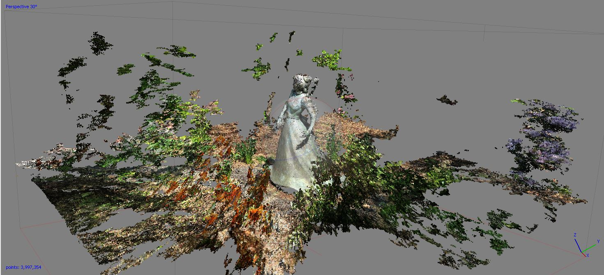

# The Quest

This repository contains a potree.js visualization of a point cloud showing the bronze statue called "The Quest" placed in front of Strand building at Oregon State University. The statue represents Alice E. Biddle, the first female graduate from what would become Oregon State University.

### Description

The data set for this work was downloaded from the class material of [Geography 4/572 course](https://github.com/jakobzhao/geog4572) at OSU.

The first part of the process, building the structure from motion (SfM), was made using the software Agisoft Photoscan. After loading in the program the 166 photos provided, I first ran the 'align photos' command under workflow, setting it to 'low' to reduce elaboration time. Then I ran the 'build dense cloud' command, setting the accuracy on 'medium'. The result is shown in the image below.

The second part of the process involved the use of the potree.js [converter](https://github.com/potree/PotreeConverter/releases/tag/1.6) tool to visualize the SfM as a point cloud. I used the .las file provided in the course material and generated, with a command line, the potree visualization [page of the statue](https://gsvevo.github.io/thequest/).
